# Lab 02: Set up your environment on Azure to migrate servers

### Estimated Duration: 90 Minutes

In this lab, you will use Azure Migrate: Server Assessment to assess the already discovered on-prem servers by creating a migration assessment in your Azure Migrate project and configuring dependencies for migration. Azure Migrate assessment is a feature within the Azure Migrate service that helps evaluate the readiness and suitability of on-premises workloads for migration to Azure. It analyzes data collected during the discovery phase to provide insights into performance, cost estimation, and compatibility

## Lab Objectives

In this lab, you will perform the following tasks:

- Task 1: Create a migration assessment
- Task 2: Configure dependency visualization

## Task 1: Create a migration assessment

In this task, you will use Azure Migrate to create a migration assessment for the SmartHotel application, using the data gathered during the discovery phase.

1. On **Azure Migrate | Servers, databases and web apps** page, select **Assess (1)** under **Azure Migrate: Discovery and assessment** and click on **Azure VM (2)** to start a new migration assessment.

    

1. On the **Basics** tab, ensure the Assessment type is set to **Azure VM (1)** and the Discovery source as **Servers discovered from Azure Migrate appliance (2)**. Then under Assessment settings, click on **Edit (3)**.

    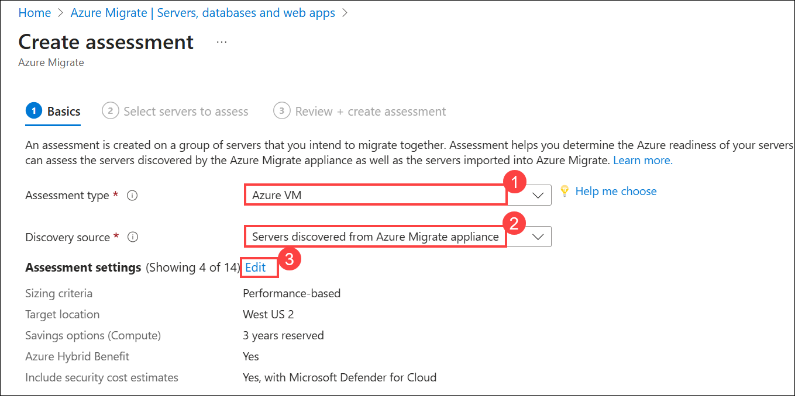

1. The **Assessment settings** blade allows you to tailor many of the settings used when making a migration assessment report. Take a few moments to explore the wide range of assessment properties. Hover over the information icons to see more details on each setting. Choose any settings you like, then select **Save**.

    > **Note:** You must make at least one change for the Save button to be enabled. If you don’t want to make any changes, simply close the blade.

    

1. Click on **Next: Select servers to assess >** to proceed to the next tab, and on the **Select servers to assess** tab, enter the following:

    - Assessment name: Enter **SmartHotelAssessment (1)** 
    - Select or create a group: Choose **Create New (2)**  
    - Enter the Group name: **SmartHotel VMs (3)**
    - Add machines to the Group:  Select **SmarthotelAppl(Hyper-V) (4)** from dropdown.
    - Select the **smarthotelweb1**, **smarthotelweb2**, **UbuntuWAF**, and **redhat** VMs **(5)** and
    - Click on **Next: Review + Create assessment (6)**.

        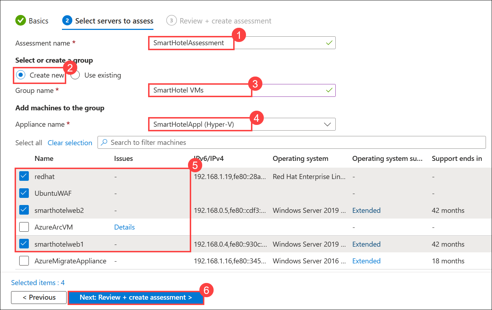

        > **Note:** There is no need to include the **smarthotelSQL1**, **AzureMigrateAppliance** and other VMs in the assessment, since they will not be migrated to Azure.
    
        > **Note:** Please note that even though we are adding a **redhat** VM to the assessment here, we will not be setting up our environment in the RedHat VM in this exercise. Users will review the assessment and perform all the steps for environment setup in HOL2.
    
1. Click on **Create assessment** to create the assessment. 

    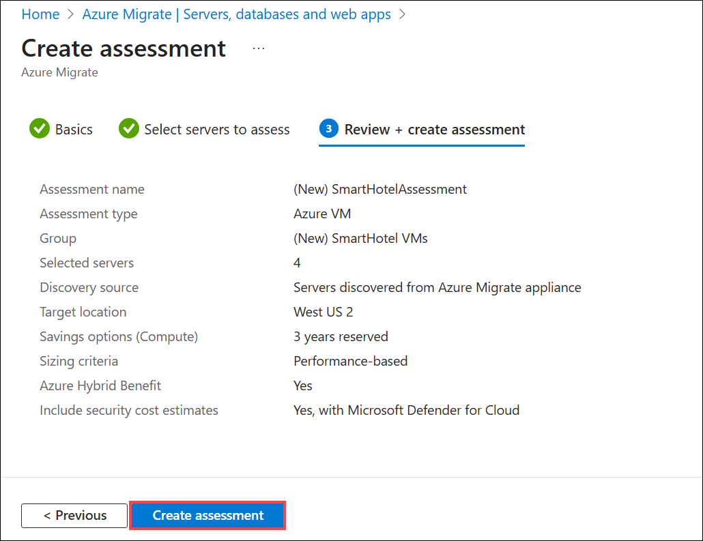

1. In Azure Migrate, on the **Servers, databases, and web apps page, Expand Migration goals (1)** from the left navigation menu. Select **Servers, databases and web apps (2)**. Click on **Refresh (3)** periodically until the number of assessments under **Assessments > Total** updates to 1 (This may take a few minutes). Then click on the nuber **1 (4)**.

    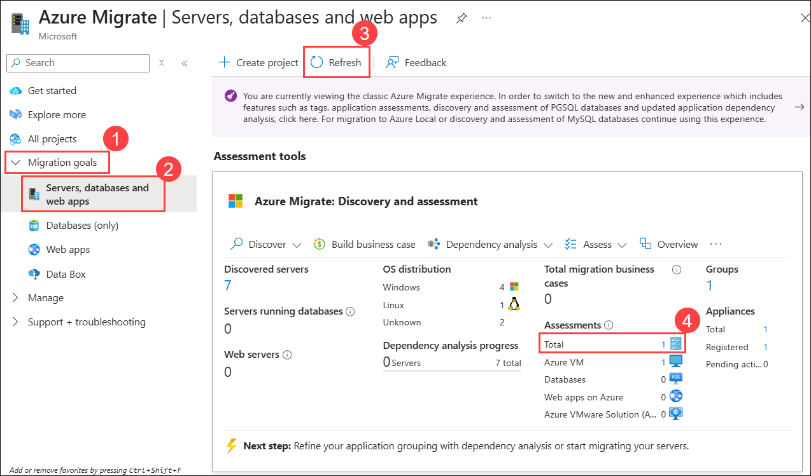

1. Select **Assessments (1)** under **Azure Migrate: Discovery and assessment** to see **SmartHotelAssessment (2)** in the list of assessments.

    ")

> **Congratulations** on completing the task! Now, it's time to validate it. Here are the steps:
> - Hit the Inline Validate button for the corresponding task. If you receive a success message, you can proceed to the next task. 
> - If not, carefully read the error message and retry the step, following the instructions in the lab guide.
> - If you need any assistance, please contact us at cloudlabs-support@spektrasystems.com. We are available 24/7 to help.

<validation step="144edc9b-9243-4a07-9692-faa649e10518" />

## Task 2: Configure dependency visualization

In this task, you will configure the Azure Migrate dependency visualization feature. This requires you to first create a Log Analytics workspace, and then to deploy agents on the to-be-migrated VMs.

When migrating a workload to Azure, it is important to understand all workload dependencies. A broken dependency could mean that the application does not run properly in Azure, perhaps in hard-to-detect ways. Some dependencies, such as those between application tiers, are obvious. Other dependencies, such as DNS lookups, Kerberos ticket validation or certificate revocation checks, are not.

Azure Migrate dependency visualization helps you identify and map these dependencies by using agents installed on the machines to be migrated. The agents collect data about network connections and process activity, and send this data to a Log Analytics workspace. The data is then processed and presented in a graphical format in the Azure Migrate portal.

1. Return to the **Azure Migrate** blade in the Azure Portal, select **Servers, databases and web apps (1)**. Under **Discovery and assessment** select **Groups (2)**.

       

1. Under the **Groups (1)** pane, select the **SmartHotel VMs (2)** group to see the group details. 

       

1. In the **SmartHotel VMs** group details page, Note that each VM has their **Dependencies** status as **Requires agent installation**. Select **Requires agent installation** for the **smarthotelweb1** VM to proceed with agent setup..

    

1. On the **Dependencies** blade, select **Configure Log Analytics workspace**.

    

1. On the **Configure Log Analytics workspace** blade, provide the below information and select **Configure (4)**.

    - Log Analytics workspace: Click on **Create new (1)** and enter **AzureMigrateWS<inject key="DeploymentID" enableCopy="false" /> (2)**
    - Log Analytics workspace location: Select **East US (3)** from the dropdown.

        

1. Once the Log Anlytics workspace is created, on the Dependencies page, scroll down and copy the **Workspace ID (1)** and **Primary Key (2)** and store in a Notepad for further use.

    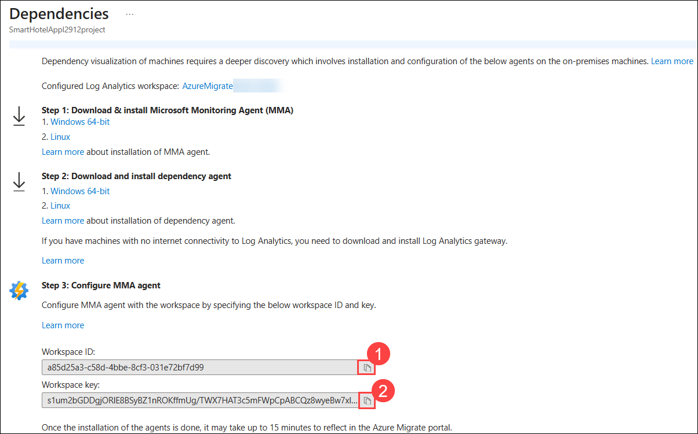

    > **Note:** If you don't see the workspace ID and key here. You can attempt to close and reopen the Workspace, or you can try refreshing the browser page. This may have been caused by a temporary error in the portal.

1. On the **Dependencies** screen, under **Step 1**, right-click to copy the download links for **Windows 64-bit** and **Linux** versions of the **Microsoft Monitoring Agent (1)**, then under **Step 2**, copy the links for the **Windows 64-bit** and **Linux** versions of the **Dependency Agent (2)**, and save them along with the previously noted **Workspace ID** and **Primary Key**.

    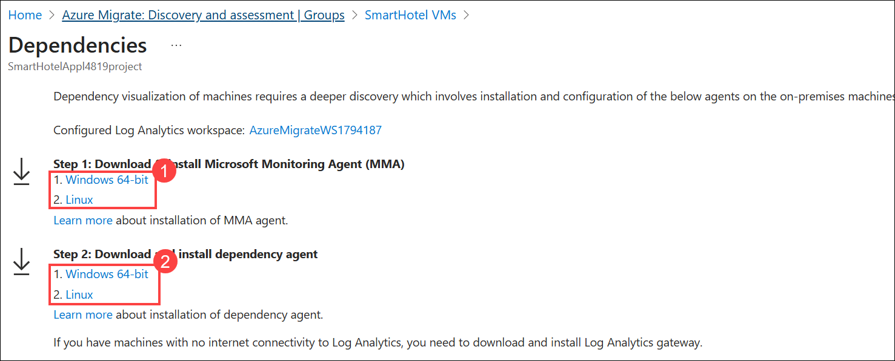

1. From **Hyper-V Manager** console, from the list of virtual machines, select **smarthotelweb1 (1)**. In the right-hand Actions pane, click **Connect (2)** to launch the VM console.

    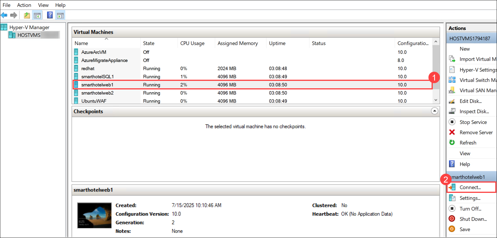

1. Select **Connect** again when prompted and log in to the **Administrator** account using the password **<inject key="SmartHotel Admin Password" />**.

    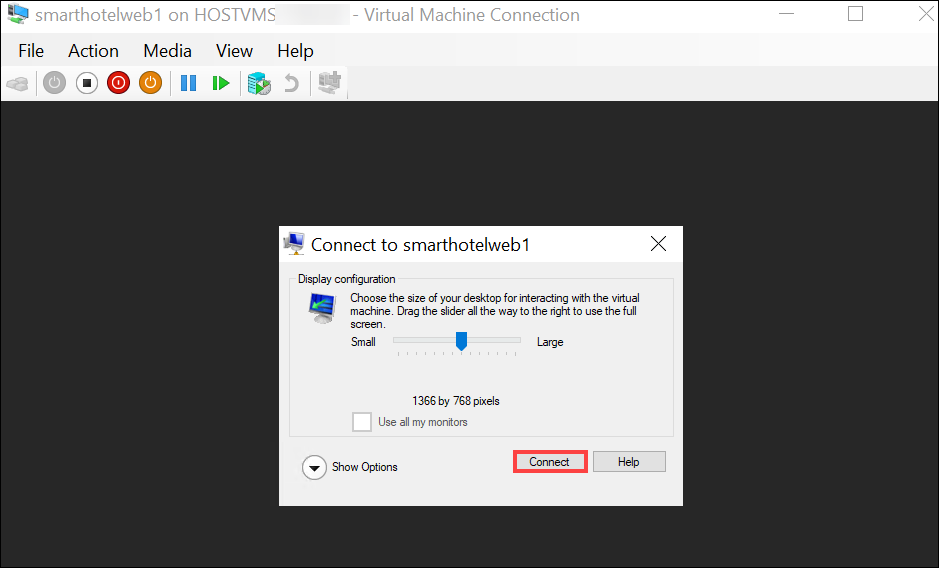

    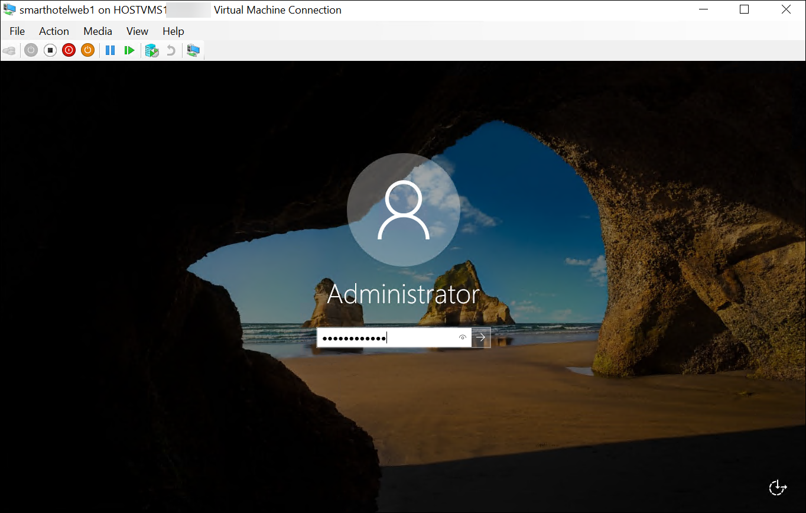

1. On the **smarthotelweb1** VM. Open **Internet Explorer** from the Start menu. Paste the link to the **64-bit Microsoft Monitoring Agent for Windows** that you saved earlier. Once the download completes, click one **Save (1)** and then **Run (2)** when prompted to start the installer.

    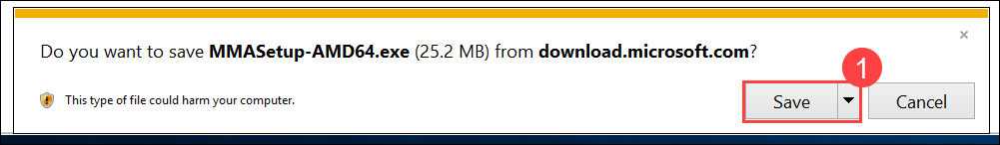

    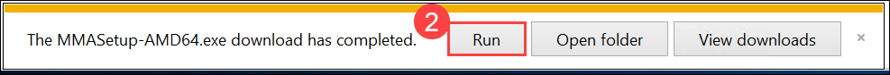

     > **Note:** If a Security alert window opens, select the **checkbox (1)** and click on **OK (2)** to proceed.

    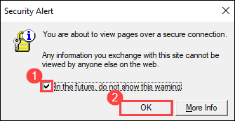

     > **Note:** Please install the Agents as mentioned in the lab guide on both SmartHotelWeb1 and SmartHotelWeb2 VMs. Read the instructions carefully to avoid mistakes.

1. On the **Welcome to the Microsoft Monitoring Agent Setup Wizard** blade, select **Next**. 

    

1. On the **Microsoft Software License Terms** blade, select **I Agree**.

    

1. On the **Destination Folder** blade, leave everything as default and select **Next**. 

     

1. On the **Agent Setup Options** blade, select **Connect the agent to Azure Log Analytics (OMS) (1)** and select **Next (2)**.

     

1. On the **Azure Log Analytics** blade, enter the **Workspace ID** and **Workspace Key (1)** that you copied earlier and then select **Next (2)**.

    

1. On the **Microsoft Update** blade, leave everything as default and select **Next**. 

    

1. On the **Ready to Install** blade, click on **Install**.

    

1. Select **Finish** to finish the installation process of **Microsoft Monitoring Agent for Windows**.

    

1. Paste the link to the **Windows Dependency Agent installer**. When prompted, click **Save** to download the file. Once the download is complete, click **Run** to launch the installer.

    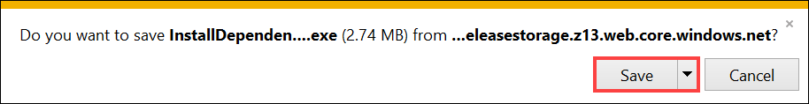

    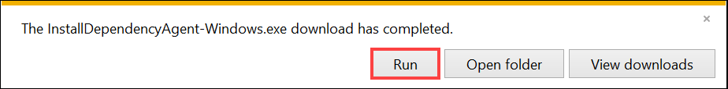

    > **Note:** If a Internet explorer securtity window opens, click on **Add (1)**, then **Add (2)** again to add the site, and then click on **Close (3)**. Then repeat the **Step 19**.

    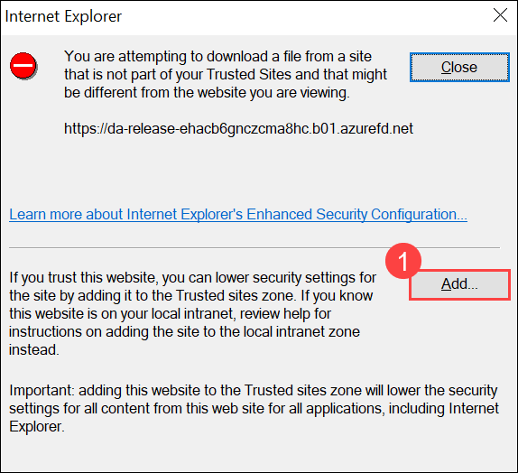

    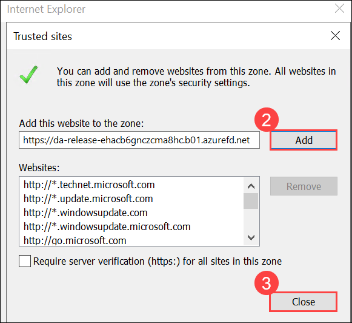

1. On the **License Agreement** blade, select **I Agree** to accept the agreement and continue. 

     

1. On the **Completing Dependency Agent Setup** blade, select **Finish** to finish the installation process.

     

    > **Note:** You do not need to configure the workspace ID and key when installing the Dependency Agent, since it uses the same settings as the Microsoft Monitoring Agent, which must be installed beforehand.

1. Minimize the Virtual Machine connection window for the **SmartHotelWeb1 VM**. Connect to the **smarthotelweb2 VM** and repeat the installation process (steps 10-21) for both agents (the administrator password is the same as for smarthotelweb1). Minimize the virtual machine connection window for the **smarthotelweb2 VM** once the installation of agents is done.

1. On you HostVM, type **cmd (1)** in the search bar and select **Command Prompt (2)** from the results to open a terminal window.  

    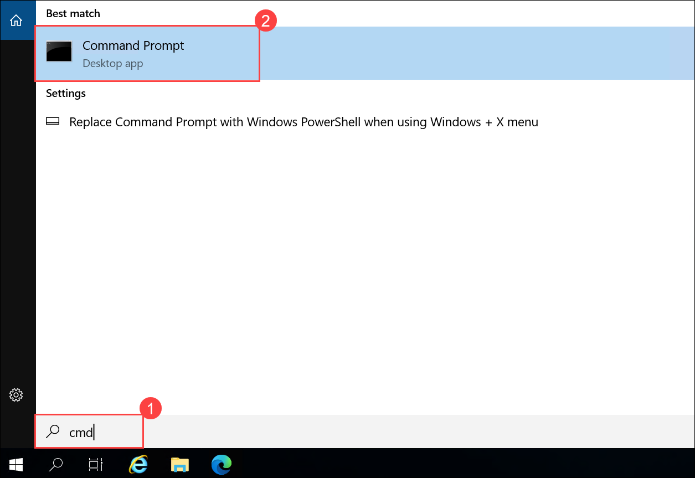

    > **Note:** The SmartHotelHost runs Windows Server 2019 with the Windows Subsystem for Linux enabled. This allows the command prompt to be used as an SSH client. More info of supported Linux on Azure can be found here: https://Azure.com/Linux. 

1. Enter the following command to connect to the **UbuntuWAF** VM running in Hyper-V on the SmartHotelHost:

    ```bash
    ssh demouser@192.168.0.8
    ```

    > **Note:** If Ctrl + V does not work in Command Prompt, right-click inside the window paste the command.

1. Enter `yes` when prompted whether to connect. Use the password **<inject key="SmartHotel Admin Password" />**.

    

1. Enter the following command, followed by the password **<inject key="SmartHotel Admin Password" />** when prompted:
  
    ```
    sudo -s
    ```

    > This gives the terminal session elevated privileges.

1. Enter the following command, substituting **\<Workspace ID\>** and **\<Primary Key\>** with the values copied previously. Answer **Yes** when prompted to **Restart services during package upgrades without asking ?**. You may need to use the **<** arrow keys on your keyboard to choose Yes

    ```
    wget https://raw.githubusercontent.com/Microsoft/OMS-Agent-for-Linux/master/installer/scripts/onboard_agent.sh && sh onboard_agent.sh -w <Workspace ID> -s <Primary Key>
    ```
    
    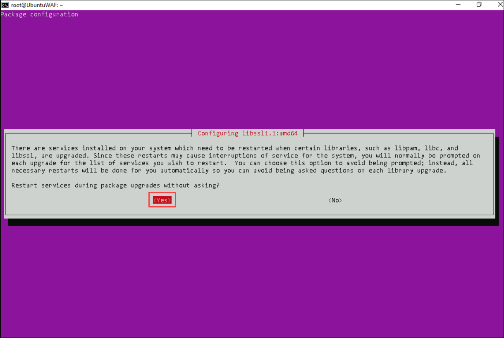

    > **Note:** If you encounter any error related to the deprecation of the log analytics agent while executing the command above, you can ignore it and proceed.

    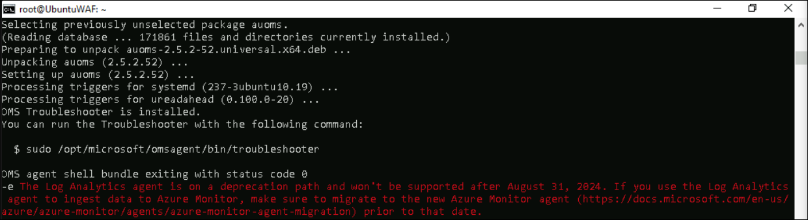

    > **Note:** If you receive any error while running the above command, run the below command to update the packages and perform **Step 27** again.
     
     ```
     apt-get update
     ```

1. Enter the following command, substituting \<Workspace ID\> with the value copied earlier:

    ```s
    /opt/microsoft/omsagent/bin/service_control restart <Workspace ID>
    ```

1. Enter the following command. This downloads a script that will install the Dependency Agent.

    ```s
    wget --content-disposition https://aka.ms/dependencyagentlinux -O InstallDependencyAgent-Linux64.bin
    ```

1. Install the dependency agent by running the script downloaded in the previous step.

    ```s
    sh InstallDependencyAgent-Linux64.bin -s
    ```

    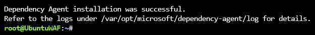
    
1. Return to the **SmartHotel VMs** group in the **Azure Migrate** portal. Refresh the page using the **browser refresh button** (not the one in the portal UI). Verify that the **Dependency Agent** status for **smarthotelweb1**, **smarthotelweb2**, and **UbuntuWAF** shows as Installed. It may take up to **20 minutes** for the status to update after installation.

    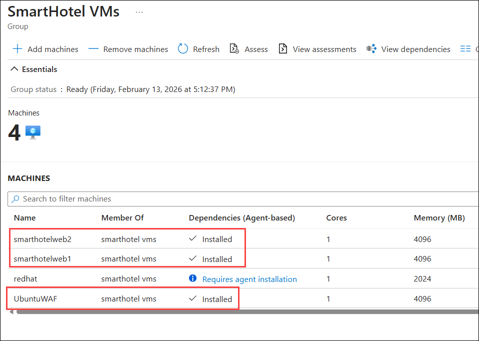

     >**Note:** If you notice that the dependency agent status is showing as **Requires Agent Installation** instead of Installed even after installing dependency agents in all the three VMs, please follow the steps from [here](https://github.com/CloudLabsAI-Azure/Know-Before-You-Go/blob/main/AIW-KBYG/AIW-Infrastructure-Migration.md#4-exercise1---task6---step1) to confirm dependency agent installation in VMs using Log Analytics workspace.
 
1. In the **SmartHotel VMs** group page, click **View dependencies** to open the dependency visualization.

    
   
1. Take a few minutes to explore the dependencies view. Expand each server to show the processes running on that server. Select a process to see process information. See which connections each server makes.

    
    
    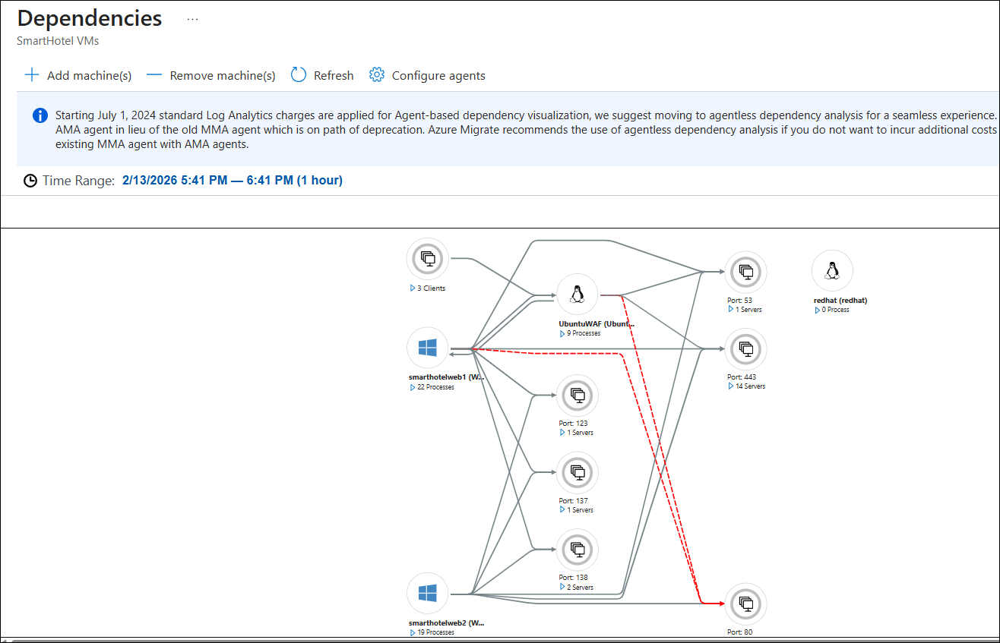

> **Congratulations** on completing the task! Now, it's time to validate it. Here are the steps:
> - Hit the Inline Validate button for the corresponding task. If you receive a success message, you can proceed to the next task. 
> - If not, carefully read the error message and retry the step, following the instructions in the lab guide.
> - If you need any assistance, please contact us at cloudlabs-support@spektrasystems.com. We are available 24/7 to help.

<validation step="d2d54d53-e9e7-419b-8982-92a36b4ea123" />

## Summary 

In this lab, you have completed the following:

- Created a migration assessment.

- Configured dependency visualization for discovered resources.

### You have successfully completed the lab. Click on **Next >>** to proceed with the next lab.

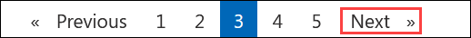
