# Lab 01: Discover your Windows Server

### Estimated Duration: 80 Minutes

In this lab, you will discover on-prem servers using the Azure Migrate Appliance. The Azure Migrate appliance is a tool provided by Microsoft to assist in the discovery and assessment of on-premises infrastructure for migration to Azure. It collects detailed information about servers, applications, databases, and workloads in your environment, including configuration, performance, and dependencies.

## Lab Objectives:

In this lab, you will perform the following tasks:

- Task 1: Set up Azure Migrate for discovery
- Task 2: Discover the on-premises VMs using Azure Migrate Appliance

## Task 1: Set up Azure Migrate for discovery

In this task, you will set up your Azure Migrate project to discover the Hyper-V servers.

1. On the Azure portal, click on the **Show Portal Menu (1)** bar on the top left corner and select **All services (2)** in the portal's left navigation.
 
    

1. In the search bar, search for **Azure Migrate** and select it from the suggestions to open the Azure Migrate Overview blade, as shown below. 
 
    

1. On the Azure Migrate page, from the left navigation pane, select **All projects (1)**, and then choose **SmartHotelMigration<inject key="DeploymentID" enableCopy="false" /> (2)**.

    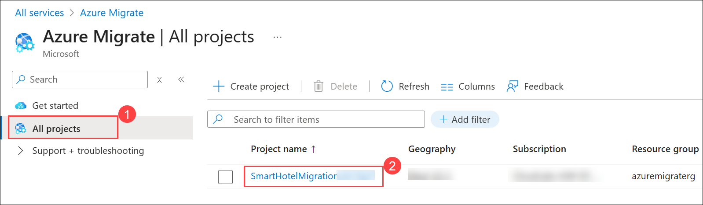

1. On the SmartHotelMigration page, select the down arrow next to **Start discovery (1)**, then choose **Using appliance (2)**, and select **For** **Azure (3)**.

    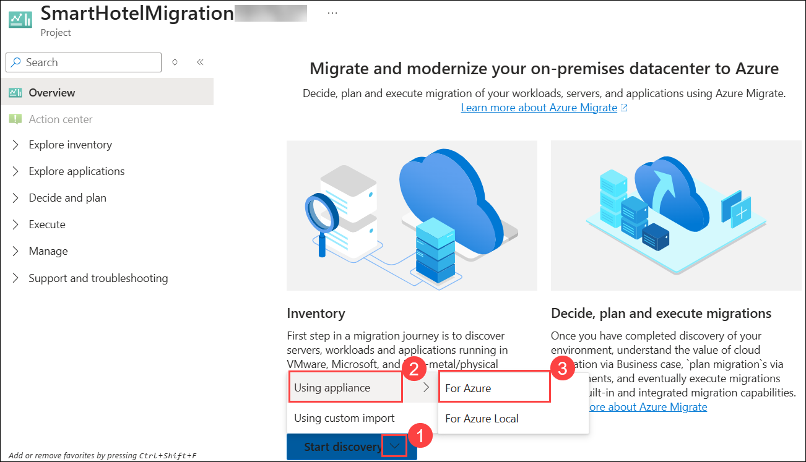

1. Under **Are your servers virtualized?**, from the **drop-down (1)** menu, select **Yes, with Hyper-V (2)**.

    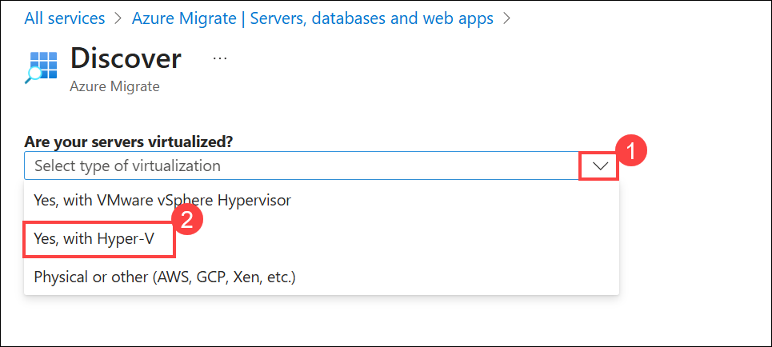

1.  In **1: Generate project key**, provide the below name for the **Azure Migrate appliance (1)** that you will set up for the discovery of Hyper-V VMs. Select **Generate key (2)** to start the creation of the required Azure resources.

     ```
     SmartHotelAppl
     ```

     

1. **Wait** for the key to be generated and copy the **Azure Migrate project key** to a notepad or any text editor for later use.

     

1.  Read through the instructions on how to download, deploy and configure the Azure Migrate appliance, then close the 'Discover machines' blade by clicking on cross button **X** (do **not** download the .VHD file or .ZIP file, the .VHD has already been downloaded for you). 

    

1. As we have created the Azure Migrate project key for the Discover and Assessment, you will be accessing the Hyper-V manager in the next tasks to start the discovery process with the help of the Azure Migrate Appliance.

## Task 2: Discover the on-premises VMs using Azure Migrate Appliance

In this task, you will deploy the Azure Migrate appliance in the on-premises Hyper-V environment. This appliance communicates with the Hyper-V server to gather configuration and performance data about your on-premises VMs and returns that data to your Azure Migrate project.

1. Now, to connect to your on-premises environment, go to the **Start (1)** button in the VM, search for **Hyper-V Manager (2)** there and select it. You will be accessing your infrastructure from the Hyper-V manager and will be connecting to the Azure Migrate Appliance VM to start the process of discovery.  

    >**Note:** You can also open the **Hyper-V manager** by clicking on the  icon that is present in the taskbar. 

      
    
1. In Hyper-V Manager, select **HOSTVMS<inject key="DeploymentID" enableCopy="false" /> (1)**. You should now see the AzureMigrateAppliance VM and six other **VMs (2)** that comprise the on-premises SmartHotel application and will be used in the next HOLs.

    
     
1. In Hyper-V Manager, select the **AzureMigrateAppliance (1)** VM, then select **Start (2)** on the right if not already running.

    
    
     > **Note:** If you get an error pop while starting the **AzureMigrateAppliance** VM try to **Turn off** the **AzureArcVM**, then start the **AzureMigrateAppliance** VM again.

1. In Hyper-V Manager, select the **AzureMigrateAppliance (1)** VM, then select **Connect (2)** on the right.

    
    
1. Under Connect to AzureMigrateAppliance, click **Connect** and then log into the VM with the administrator password **<inject key="SmartHotel Admin Password" />** (the login screen may pick up your local keyboard mapping, use the 'eyeball' icon to check).
 
    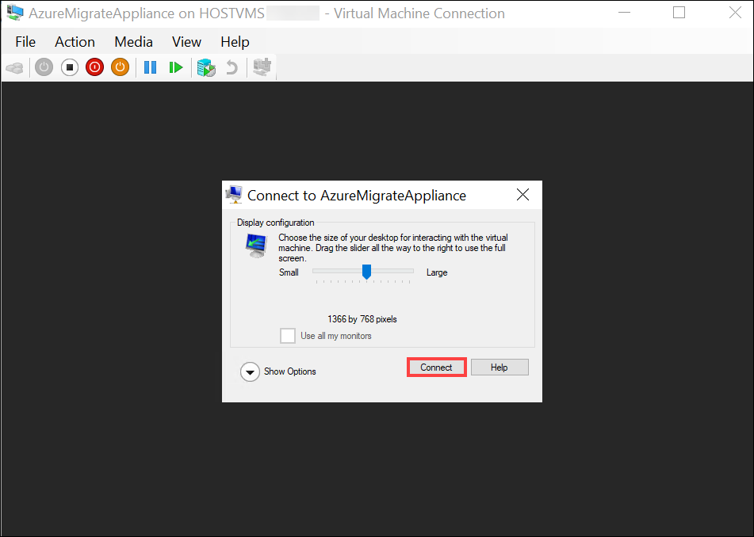

    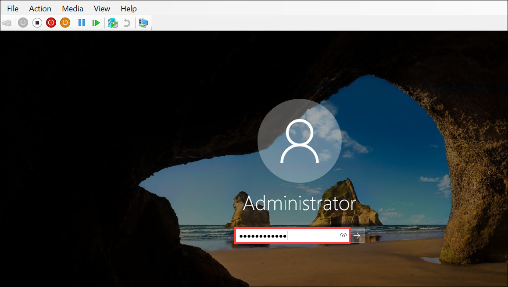

1. Launch the **Azure Migrate appliance configuration Manager wizard** using the shortcut available on the desktop (wait for a minute or two, the browser will open showing the Azure Migrate appliance configuration wizard)

     > **Note:** If you are prompted with New updates available pop-up when connected with AzureMigrateAppliance VM, just click on View updates and then close the settings panel for now.

    
    
    >**Note:** If you receive a prompt asking for credentials after launching the **Azure Migrate appliance configuration wizard** using the shortcut available on the desktop, please follow the instructions from [here](https://github.com/CloudLabsAI-Azure/Know-Before-You-Go/blob/main/AIW-KBYG/AIW-Infrastructure-Migration.md#1-exercise1---task3---step3) to connect to the Azure Migrate appliance configuration wizard.

1. On opening the appliance configuration wizard, if a pop-up with the license terms appears, accept the terms by selecting **I agree**.

    

1. Under **Set up prerequisites**, the following two steps to verify Internet connectivity and time synchronization should pass automatically.

    

1. At the next phase of the wizard, **Check latest updates and register appliance**, paste the **Azure Migrate project key (1)** that you copied from the Azure portal earlier and select **Verify (2)** to verify the Azure Migrate project key. 

     

1. **Wait** for some time while the wizard installs the latest Azure Migrate updates. If prompted for credentials, enter username **Administrator** and password **<inject key="SmartHotel Admin Password" />**. Once the Azure Migrate updates are completed, you may see a pop-up if the management app restart is required, and if so, select **Refresh** to restart the app. Then click on **Verify** again. 

    

1. Wait for the **Appliance auto-update status** to complete which may take about 5 minutes, and select **Login**. 

    

1. Now, follow the instructions below to complete the login process.
    
    - At first, you will be presented with a **Continue with Azure login** pop-up. On the **Continue with Azure login** pop-up dialog, copy the code in the **Notepad** and click on **Copy code & Login**.
   
        
  
    - This will open an Azure login prompt in a new browser tab (if it doesn't appear, make sure the pop-up blocker in the browser is disabled), paste the **Code (1)** which you copied in the notepad and click on **Next (2)**. You will then be asked for your Azure portal credentials to complete the login process.

        

    - Log in using the provided Azure credentials.

         * **Azure Username/Email:** <inject key="AzureAdUserEmail"></inject> 

           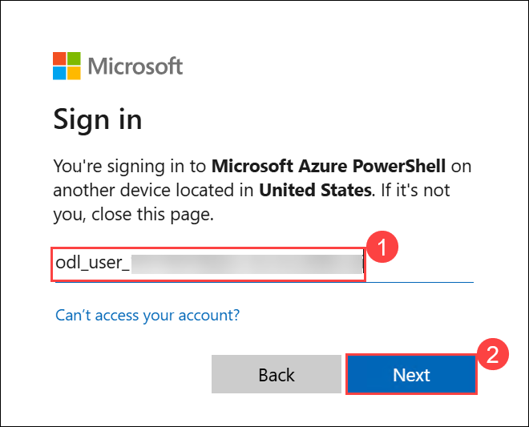

         * **Azure Password:** <inject key="AzureAdUserPassword"></inject> 
     
           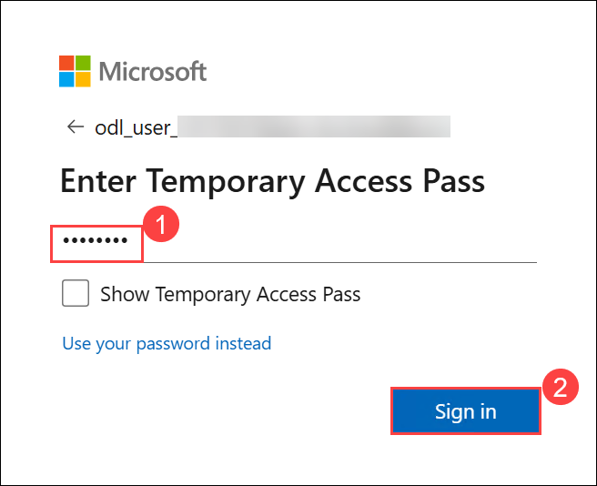

    - On the **Are you trying to sign in to Microsoft Azure PowerShell?** prompt, select **Continue** to complete the login.

        

1. Once signed in, return to the Azure Migrate Appliance tab the appliance registration will begin automatically and display The appliance has been successfully registered once complete.

    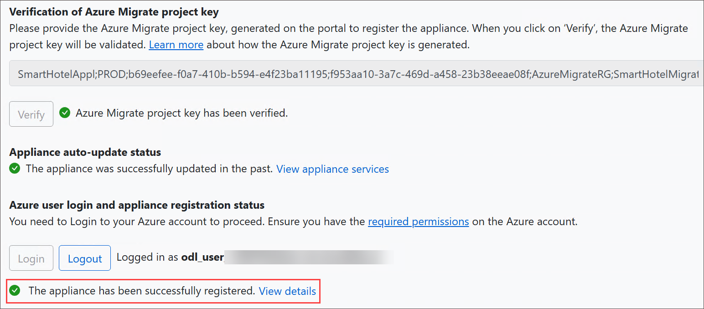

1. In **Step 1: Provide Hyper-V host credentials for the discovery of Hyper-V VMs** under **2. Manage credentials and discovery sources**, select **Add credentials**.

    

1. Specify the following details on the **Add credentials** blade for the Hyper-V host/cluster that the appliance will use to discover VMs and select **Save (4)**.
 
    - Friendly name: Enter **hostlogin (1)** 
    - Username: **<inject key="SmartHotelHost Admin Username" /> (2)**
    - Password: **<inject key="SmartHotelHost Admin Password" /> (3)**

        

        > **Note:** The Azure Migrate appliance may not have picked up your local keyboard mapping. Select the 'eyeball' in the password box to check that the password was entered correctly.

1. In **Step 2: Provide Hyper-V host/cluster details**, select **Add discovery source** to specify the IP address or FQDN of the Hyper-V host/cluster.

    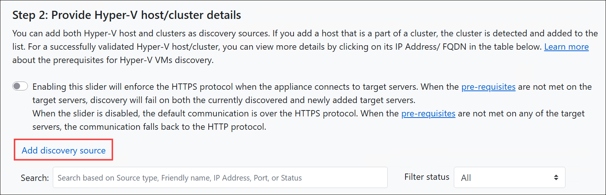

1. On the **Add discovery source** blade, provide the following details:
     
    - Select **Add single item (1)**
    - IP Address / FQDN:  Enter **HOSTVMS<inject key="DeploymentID" enableCopy="false" /> (2)** 
    - Friendly name: Select **hostlogin (3)** from the dropdown and 
    - Select **Save (4)**.

        

        > **Note:** You can either **Add single item** at a time or **Add multiple items** in one go. There is also an option to provide Hyper-V host/cluster details through **Import CSV**.

1. The appliance will validate the connection to the Hyper-V hosts/clusters added and show the **Validation status** in the table against each host/cluster

   

    > **Note:** When adding discovery sources:
    > - For successfully validated hosts/clusters, you can view more details by selecting their IP address/FQDN.
    > - If validation fails for a host, review the error by selecting Validation failed in the Status column of the table. Fix the issue and validate again.
    > - To remove hosts or clusters, select **Delete**.
    > - You can't remove a specific host from a cluster. You can only remove the entire cluster.
    > - You can add a cluster, even if there are issues with specific hosts in the cluster.

1. In **Step 3: Provide server credentials to perform guest discovery of installed software, dependencies and workloads**, **Disable the slider (1)** and scroll down to select **Start discovery (2)** to kick off VM discovery from the successfully validated hosts/clusters.

   > **Note:** The discovery process can take up to 10 minutes. 
   
   

1. Wait for the Azure Migrate status to show **Discovery has been successfully initiated**.

   > **Note:** The discovery process sometimes may take 15-20 minutes or more. After the discovery has been successfully initiated, you can check the discovery status against each host/cluster in the table.

   

   >**Note:** **Wait for the discovery process to complete before proceeding to the next Task**.

1. Return to the **LabVM**, then navigate to the **Azure Migrate** page in the Azure portal. From the left navigation pane, select **All projects (1)**, and then choose **SmartHotelMigration<inject key="DeploymentID" enableCopy="false" /> (2)**.

    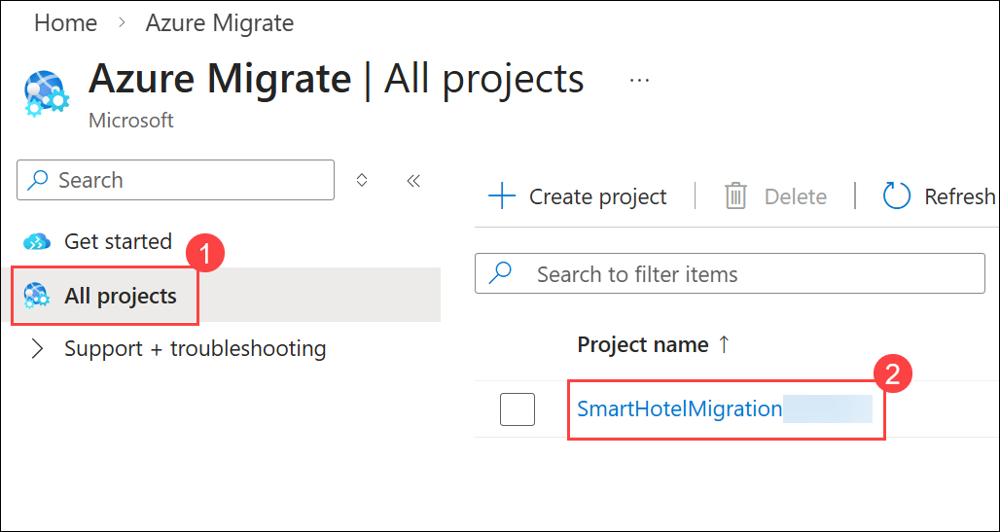

1. Scroll down and click on **click here** to view details in the old experience.

    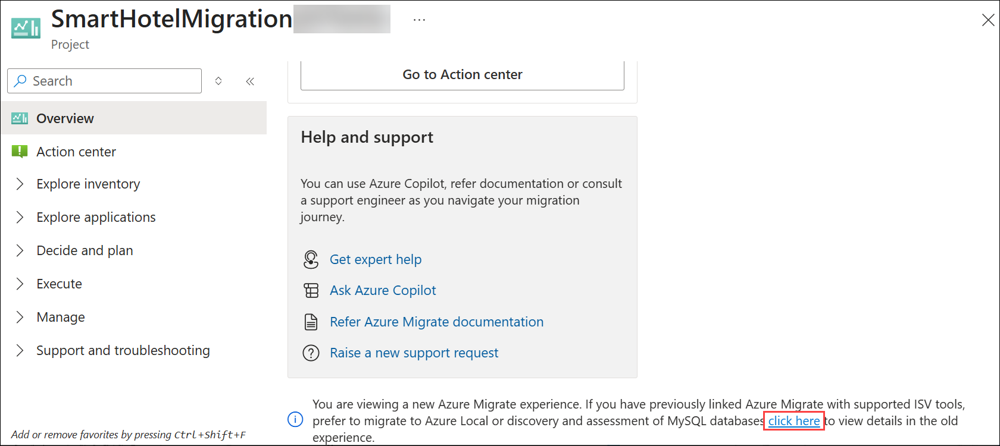

1. Return to the **JumpVM** then to **Azure Migrate** blade in the Azure portal.  Select **Servers, databases, and web apps (1)**, then select **Refresh (2)**.  Under **Azure Migrate: Servers, databases and web apps**, you should see a **count (3)** of the number of servers discovered so far. If discovery is still in progress, select **Refresh** periodically until 7 discovered servers are shown. This may take several minutes.

    .png)

## Summary 

In this lab, you have completed the following:

- Set up Azure Migrate for environment discovery.

- Discovered on-premises virtual machines using the Azure Migrate Appliance.

### You have successfully completed the lab. Click on **Next >>** to proceed with the next lab.

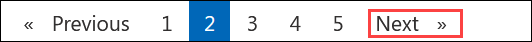
