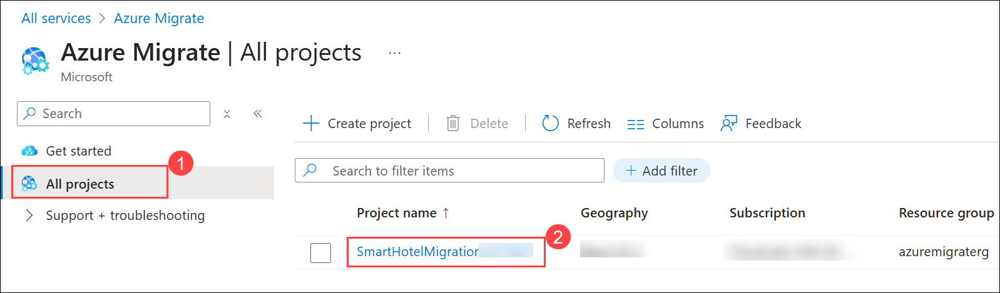
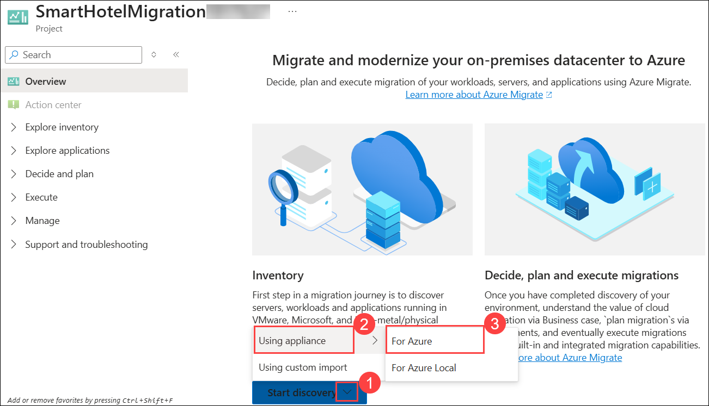

# Exercise 01: Discovery, Assess, and Plan - Evaluate your current environment

### Estimated Duration: 4 hours

## Overview

In this exercise, you will deploy the Azure Migrate appliance in the on-premises Hyper-V environment. This appliance communicates with the Hyper-V server to gather configuration and performance data about your on-premises VMs and returns that data to your Azure Migrate project.

## Lab objectives

After completing this exercise, you will:
- Task 1: Explore Azure Migrate and understand the appliance's role
- Task 2: Deploy, configure, and connect the Azure Migrate appliance
- Task 3: Discover on-premises VMs and validate migration readiness

## Task 1: Explore Azure Migrate and understand the appliance's role

In this task, you will explore the Azure Migrate service and understand how the appliance facilitates migration assessments.

1. Click on **Show Portal Menu (☰) (1)**  bar and select **All services (2)** from the left navigation pane.
 
    

2. In the search bar, search for **Azure Migrate** and select it from the suggestions to open the Azure Migrate Overview blade, as shown below. 
 
    

1. On the **Azure Migrate** page, from the left navigation pane, select **All projects (1)**, and then choose **SmartHotelMigration<inject key="DeploymentID" enableCopy="false" /> (2)**.
 
    

1. On the **SmartHotelMigration<inject key="DeploymentID" enableCopy="false" />** page, select the down arrow next to **Start discovery (1)**, then choose **Using appliance (2)**, and select **For Azure (3)**.

   

3. Under **Migration goals**, click **Servers, databases and web apps (1)** and then select **Discover (2)** and choose **Using appliance (3)** under **Azure Migrate: Discovery and assessment** to open the **Discover** blade.
 
    new.png)
 
4. In the **Discover** blade, under **Are your servers virtualized? (1)**, select **Yes, with Hyper-V (2)** from the drop-down list.

    

5.  In **Step 1: Generate project key**, enter a name for the **Azure Migrate appliance (1)** to be used for discovering Hyper-V VMs, then click **Generate key (2)** to initiate the creation of the necessary Azure resources.

     ```
     SmartHotelAppl
     ```
    

6.  Wait for the **Azure Migrate project key** to be generated, then click the **copy icon** to securely copy the key to your clipboard. This key will be required during the appliance registration process.

    

7.  Review the steps for downloading, deploying, and configuring the Azure Migrate appliance, then click the **Close** button to exit the Discover blade (do not download the .VHD or .ZIP file, as the .VHD has already been provided.)

    

8. Now that the Azure Migrate project key has been generated, you will proceed to access Hyper-V Manager in the next task to initiate the discovery process using the Azure Migrate appliance.

## Task 2: Deploy, configure, and connect the Azure Migrate appliance

In this task, you will deploy the Azure Migrate appliance in Hyper-V and connect it to your Azure Migrate project.

1. To connect to your on-premises environment, Click the **Start (1)** button, type **Hyper-V Manager (2)** in the search bar, and select **Hyper-V Manager (3)** from the results. You will access your infrastructure through Hyper-V Manager and connect to the Azure Migrate Appliance VM to begin the discovery process.

      

2. In Hyper-V Manager, select **HOSTVMS<inject key="DeploymentID" enableCopy="false" /> (1)**. You will see the **AzureMigrateAppliance VM (2)** along with seven other VMs that make up the on-premises SmartHotel application, which will be used in the upcoming hands-on labs.

    

3. In Hyper-V Manager, select the **AzureMigrateAppliance (1)** VM, then click **Start (2)** on the right pane if the VM is not already running.

    

    > **Note:** If an error occurs while starting the **AzureMigrateAppliance** VM, try turning off the **AzureArcVM** first, then start the **AzureMigrateAppliance** VM again.

    > **Note:** **Follow these steps and run the commands one-by-one from the code block.**

    1. On the **Lab VM**, open **Windows PowerShell** (blue icon) **Run as administrator**.

    1. Copy the code block below.

    1. Paste **one line at a time** into PowerShell and press **Enter** after each line.

    1. After the last line, confirm the VM **State** shows **Running**.

        ```powershell
        $vm = "AzureMigrateAppliance"

        Import-Module Hyper-V -ErrorAction SilentlyContinue

        if (-not (Get-Command Get-VM -ErrorAction SilentlyContinue)) { DISM /Online /Enable-Feature /FeatureName:Microsoft-Hyper-V-Management-PowerShell /All }

        Import-Module Hyper-V

        Remove-VMSavedState -VMName $vm -ErrorAction SilentlyContinue

        Stop-VM -Name $vm -TurnOff -ErrorAction SilentlyContinue

        Set-VMProcessor -VMName $vm -CompatibilityForMigrationEnabled $true

        Set-VMMemory -VMName $vm -DynamicMemoryEnabled $true -StartupBytes 4096MB -MinimumBytes 2048MB -MaximumBytes 8192MB

        Start-VM -Name $vm -ErrorAction SilentlyContinue

        if ((Get-VM -Name $vm).State -ne 'Running') { Set-VMMemory -VMName $vm -DynamicMemoryEnabled $true -StartupBytes 2048MB -MinimumBytes 1024MB -MaximumBytes 8192MB; Start-VM -Name $vm }

        Get-VM -Name $vm | Select Name, State, Status, MemoryAssigned | Format-Table -Auto
        ```

4. In Hyper-V Manager, select the **AzureMigrateAppliance (1)** VM, then click **Connect (2)** on the right pane.

        


5. Click **Connect** to initiate the virtual machine session for **AzureMigrateAppliance**.
 
    

6. Log into the VM using the administrator password **<inject key="SmartHotel Admin Password" />**.
    
    

7. Launch the **Azure Migrate appliance configuration Manager wizard** by double-clicking the shortcut on the desktop.

     > **Note:** If a New updates available pop-up appears when connected to the AzureMigrateAppliance VM, click View updates, then close the settings panel for now.

    
    
    >**Note:** If you receive a prompt asking for credentials after launching the **Azure Migrate appliance configuration wizard** using the shortcut available on the desktop, please follow the instructions from [here](https://github.com/CloudLabsAI-Azure/Know-Before-You-Go/blob/main/AIW-KBYG/AIW-Infrastructure-Migration.md#1-exercise1---task3---step3) to connect to the Azure Migrate appliance configuration wizard.

8. When the Azure Migrate appliance configuration wizard opens, you may see a pop-up with the license terms. Please read and accept the terms by clicking the **I agree** button to proceed.

    

9. Under **Set up prerequisites**, ensure that both **Check connectivity to Azure** and **Check time is in sync with Azure** complete successfully. These steps validate internet connectivity and time synchronization and should complete automatically.

    

10. At the next step, **Check latest updates and register appliance**, paste the **Azure Migrate project key (1)** that you copied from the Azure portal earlier, then click **Verify (2)** to validate the project key.

    

11. **Wait** for some time while the wizard installs the latest Azure Migrate updates. If prompted for credentials, enter username **Administrator** and password **<inject key="SmartHotel Admin Password" />**. Once the Azure Migrate updates are completed, you may see a pop-up if the management app restart is required, and if so, select **Refresh** to restart the app.  

    

12. Wait for the **Appliance auto-update status (1)** to show success (may take up to 5 minutes), then click **Login (2)** to proceed.

    new.png "Azure Migrate login code")
   
    > Now, follow the instructions below to complete the login process.
    
    > **Note:** If the appliance update fails, run the following command in **powershell as Administrator** to update the AzureMigrateAppliance Hyper-V Windows VM version. After the command executes successfully, click **OK**.
    >   
    > ```
    > slmgr /rearm
    > ```  
    >   
    > Restart AzureMigrateAppliance Hyper-V VM and reperform from Task 2, step 5.

13. When the **Continue with Azure Login** pop-up appears, click **Copy code & Login** to copy the device code and open the Azure authentication page.
   
     
  
14. This will open an Azure login prompt in a new browser tab (disable pop-up blocker if it doesn't appear), paste the **code (1)**, click **Next (2)**, and enter your Azure portal credentials to complete the login process.

     

15. Login using the provided Azure credentials and click **Continue** on the **Are you trying to sign in to Microsoft Azure PowerShell?** prompt.
    
     * Azure Username/Email: <inject key="AzureAdUserEmail"></inject> 
     
     * Azure Password: <inject key="AzureAdUserPassword"></inject> 

       

16. After successful login, return to the **Azure Migrate Appliance** tab, registration will begin automatically and show the success message once complete.   
        
    

    Once the registration has been completed, you can proceed to the next panel, **Manage credentials and discovery sources**.

## Task 3: Discover on-premises VMs and validate migration readiness

In this task, you will configure discovery settings, initiate VM discovery, and validate the results in Azure Migrate.

1. To begin adding Hyper-V host credentials for VM discovery, click **Add credentials** under **Step 1** on the **Manage credentials and discovery sources** page.

    

1. Specify the following details on the **Add credentials** blade for the Hyper-V host/cluster the appliance will use to discover VMs, then click **Save (4)**:

      1. Friendly name: **hostlogin (1)** 
      
      2. Username: **<inject key="SmartHotelHost Admin Username" /> (2)**
      
      3. Password: **<inject key="SmartHotelHost Admin Password" /> (3)**

         

         > **Note:** If the Azure Migrate appliance isn’t recognizing your local keyboard mapping, click the ‘eyeball’ icon in the password box to verify that your password was entered correctly..

1. To provide **Hyper-V host/cluster** details, click **Add discovery source** under **Step 2** on the **Manage credentials and discovery sources** page.

    

1. On the **Add discovery source** blade, provide the following details:
     
      1. Select **Add single item (1)**
      
      1. IP Address / FQDN:  Enter **HOSTVMS<inject key="DeploymentID" enableCopy="false" /> (2)** 
      
      1. Map credentials: Select **hostlogin (3)** from the dropdown.
      
      1. Click **Save (4)** to add the discovery source.

         

         > **Note:** You can add discovery sources one at a time using **Add single item**, add multiple items at once with **Add multiple items**, or upload details via **Import CSV**.

5. The appliance will validate the connection to each added Hyper-V host or cluster and display the validation status in the table under the **Status** column.

    

    > **Note:** When adding discovery sources:
    > - For successfully validated hosts/clusters, you can view more details by selecting their IP address/FQDN.
    > - If validation fails for a host, review the error by selecting Validation failed in the Status column of the table. Fix the issue and validate again.
    > - To remove hosts or clusters, select **Delete**.
    > - You can't remove a specific host from a cluster. You can only remove the entire cluster.
    > - You can add a cluster, even if there are issues with specific hosts in the cluster.

6. In **Step 3**, disable the **slider (1)** and click **Start discovery (2)** to begin VM discovery from the successfully validated hosts/clusters.

     > **Note:** The discovery process can take up to 10 minutes. 
   
    
    
    

7. Wait for the Azure Migrate status to confirm that **Discovery has been successfully initiated**, which may take several minutes. Once initiated, you can monitor the discovery status for each host or cluster in the table.

    new.png "Azure Migrate login code")

8. Return to the **JumpVM**, open the **Azure Migrate** blade in the Azure portal, select **Servers, databases, and web apps (1)**, click **Refresh (2)**, and wait until **7 servers** are shown under **Discovered servers (3)**. This process may take several minutes.

    new.png "Azure Migrate login code")
     
    > **Congratulations** on completing the task! Now, it's time to validate it. Here are the steps:
    > - Hit the Inline Validate button for the corresponding task. If you receive a success message, you can proceed to the next task. 
    > - If not, carefully read the error message and retry the step, following the instructions in the lab guide.
    > - If you need any assistance, please contact us at cloudlabs-support@spektrasystems.com. We are available 24/7 to help.

<validation step="f46f663f-2c8d-473c-99b3-15243457b6ec" />

>**Note:** If you complete the lab ahead of the allotted time, please review and validate. Once validation is successful, you may proceed to delete the respective lab.

## Summary 

In this exercise, you explored an Azure Migrate project and the default built-in tools for server assessment and server migration. You have also configured the Azure Migrate appliance in the on-premises Hyper-V environment and started the migration assessment discovery process using Azure Migrate.

### You have successfully completed the Hands-on Lab.
